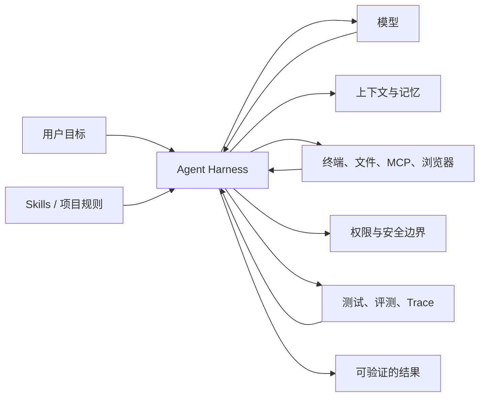

# Agent Harness 专题

## Harness 是什么

模型负责推理，Harness 负责让模型在真实工程环境里可靠地工作。它是模型外面的一层运行与控制系统，通常包含：

- 上下文装载与压缩；
- 工具定义、调用和结果反馈；
- 文件、命令、网络和密钥权限；
- Agent 循环、停止条件和失败恢复；
- 记忆、任务状态与多 Agent 协作；
- 测试、评测、日志、trace 和交付证据。

Pi Coding Agent 和 OpenCode 本身就是 Coding Agent Harness。它们把模型、终端、文件系统、工具与 Skill 组合成可执行的工作环境。Skill 是 Harness 装载的一类能力说明，二者不是同一个层次。



## 对算法工程师的实际价值

一个好的 Harness 会把“让 Agent 帮忙写代码”变成可复用流程。例如训练任务可以固定为：读取数据契约 → 检查泄漏 → 运行小样本 → 完整训练 → 评测 → 保存环境与指标 → 生成报告。模型可以更换，但验证入口、权限、trace 和交付标准仍然保留。

常见提升包括：

1. **减少上下文浪费**：只在需要时加载对应 Skill 和资料。
2. **降低误操作**：给命令和目录设置明确权限。
3. **提高长任务成功率**：保存任务状态和检查点，失败后可恢复。
4. **让结果可审查**：每个完成声明都对应测试、指标或 trace。
5. **沉淀团队经验**：把数据审计、训练、评测和故障处理写成 Skill。

## Harness 相关 Skill 与项目

| 项目 | 能解决什么 | 推荐判断 | 链接 |
|---|---|---|---|
| Agents Best Practices | 系统讲解 loop、工具、权限、上下文压缩、记忆、MCP、编排、观测和评测 | 最适合先理解完整架构；通用 `SKILL.md` | [GitHub](https://github.com/DenisSergeevitch/agents-best-practices) |
| Agent Harness Skill | 审计并补齐仓库的 Agent 入口、约束、验证命令和 CI 契约 | 适合把已有工程改造成 Agent 友好仓库 | [GitHub](https://github.com/netresearch/agent-harness-skill) |
| Agent Harness Skills | 五个可组合 Skill：评估、边界、验证、运行证据、交付状态 | OpenCode 适配明确；项目较新，先试点 | [GitHub](https://github.com/yfge/agent-harness-skills) |
| Better Harness | 扫描仓库并提出 Harness 改进 | 有较多关注，但未明确支持 Pi/OpenCode，作为参考或手工适配 | [GitHub](https://github.com/QoderAI/better-harness) |
| Plain Concepts Agent Harness | OpenCode、规范、代码图、记忆和并行 Agent 的整套方案 | 偏完整框架，改动比单个 Skill 大 | [GitHub](https://github.com/PlainConceptsPlatform/agent-harness) |
| madebywild/agent-harness | 在多种 Agent 配置之间同步 Harness 来源 | 适合研究跨客户端配置生成；Pi/OpenCode 需评估 | [GitHub](https://github.com/madebywild/agent-harness) |
| SUNRNEHUI/agent-harness | 运行时中立的 Harness 契约和适配器思路 | 新项目，当前主要适配其他 Agent | [GitHub](https://github.com/SUNRNEHUI/agent-harness) |
| Skillet | 用 `spec.md`、`SKILL.md` 和 eval cases 构建及验证 Skill | 适合团队做自己的可评测 Skill | [GitHub](https://github.com/getsentry/skillet) |

## 团队落地顺序

### 第一阶段：让仓库可被 Agent 理解

- 根目录提供精简的 `AGENTS.md`，写清目录、命令、边界和完成标准。
- 把安装、格式化、单测、集成测试、训练小样本写成稳定命令。
- 给大数据和耗时训练提供小规模验证模式。

### 第二阶段：把重复工作变成 Skill

- 数据质量审计；
- 防泄漏实验设计；
- 训练配置检查；
- 指标比较与回归判断；
- 线上问题定位；
- 技术报告和 PR 生成。

### 第三阶段：加入证据和评测

- 保存测试输出、模型指标、环境信息和 trace；
- 给 Skill 建立成功/失败样例；
- 记录 Agent 在何处反复失败，再改规则或工具；
- 以任务成功率、人工返工次数和总耗时评价 Harness，而非只看回答风格。

## 一个最小仓库结构

```text
project/
├── AGENTS.md
├── .agents/
│   └── skills/
│       ├── data-audit/SKILL.md
│       ├── train-small/SKILL.md
│       └── evaluate-model/SKILL.md
├── scripts/
│   ├── check_data.py
│   ├── train_smoke.py
│   └── evaluate.py
├── tests/
└── artifacts/
    └── README.md
```

关键不是文件数量，而是让 Agent 能准确回答三个问题：现在允许做什么、怎样验证、什么证据才算完成。
